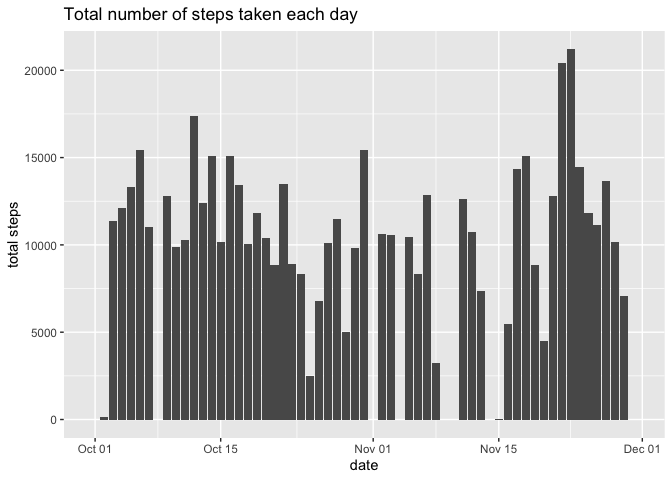
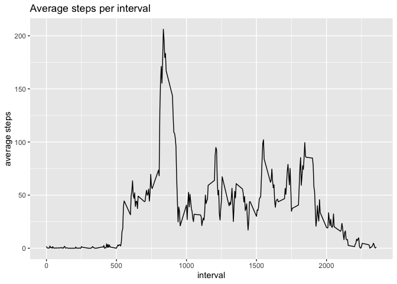
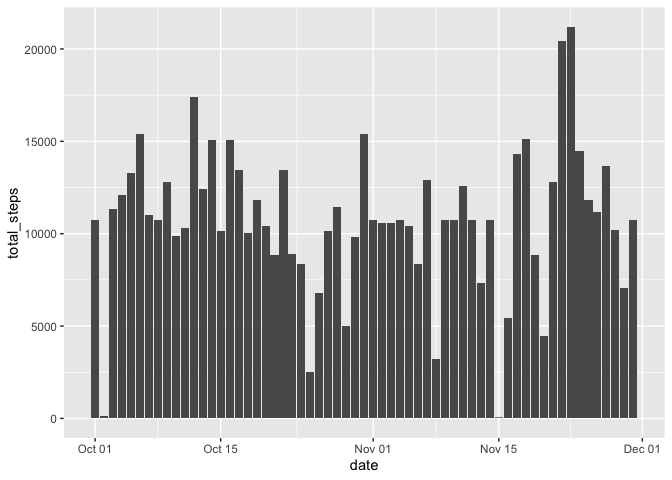
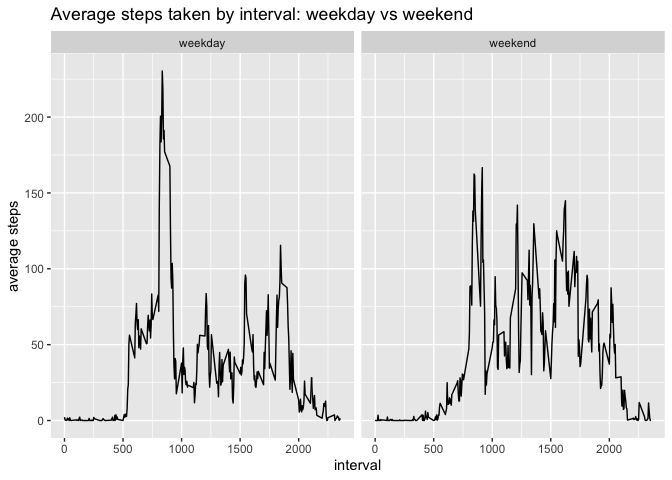

### Load package

    library(tidyverse)

    ## ── Attaching core tidyverse packages ────────────────── tidyverse 2.0.0 ──
    ## ✔ dplyr     1.1.4     ✔ readr     2.1.5
    ## ✔ forcats   1.0.0     ✔ stringr   1.5.1
    ## ✔ ggplot2   3.5.1     ✔ tibble    3.2.1
    ## ✔ lubridate 1.9.3     ✔ tidyr     1.3.1
    ## ✔ purrr     1.0.2     
    ## ── Conflicts ──────────────────────────────────── tidyverse_conflicts() ──
    ## ✖ dplyr::filter() masks stats::filter()
    ## ✖ dplyr::lag()    masks stats::lag()
    ## ℹ Use the conflicted package (<http://conflicted.r-lib.org/>) to force all conflicts to become errors

### Read file

    # create raw file directory
    if(!file.exists("raw")) {
        dir.create("raw")
    }

    # download file
    download.file("https://d396qusza40orc.cloudfront.net/repdata%2Fdata%2Factivity.zip",
                  destfile = "raw/data.zip",
                  method = "curl")

    # unzip the file
    unzip("raw/data.zip", exdir = "raw")

    # load the dataset
    data <- read.csv("raw/activity.csv")

### Format data

    data$date <- ymd(data$date)

### What is mean total number of steps taken per day?

#### 1. Calculate the total number of steps taken per day

    no_steps_day <- data |> 
        group_by(date) |> 
        summarise(total_steps = sum(steps, na.rm = TRUE))

    no_steps_day

#### 2. Total number steps taken each day in histogram

    ggplot(no_steps_day, aes(date, total_steps)) +
        geom_col() +
        labs(y = "total steps", title = "Total number of steps taken each day")

#### 3. Median and mean of the total number of steps taken per day

    mean <- mean(no_steps_day$total_steps)
    median <- median(no_steps_day$total_steps)

The mean is 9354.2295082 The median is 10395

### What is the average daily acitivity pattern?

#### 1. Time-series plot

    # format the interval col in hour-minute format
    no_steps_interval <- data |> 
        group_by(interval) |> 
        summarise(average_steps = mean(steps, na.rm = TRUE))

    # plot the time series graph
    ggplot(no_steps_interval, aes(interval, average_steps)) +
        geom_line() +
        labs(y = "average steps", title = "Average steps per interval")

#### 2. Which interval has the highest step

    index <- which(no_steps_interval$average_steps == max(no_steps_interval$average_steps, na.rm = TRUE))

    interval <- no_steps_interval[index, "interval"]

Time `R interval` has the highest number of steps

### Inputting missing values

#### 1. Calculate and report the total number of NAs in steps col

    missing_data <- data[is.na(data$steps), "steps"]
    length_missing <- length(missing_data)

There are `R length_missing` missing values in the data

#### 2. Fill in the missing values with the mean of that interval

    data_missing_filled <- data |> 
        left_join(no_steps_interval, 
                  by = "interval") |> 
        mutate(steps = ifelse(is.na(steps),
                               average_steps,
                               steps))

#### 3. New df with NAs filled in

    data_missing_filled

#### 4. Histogram of total steps per day, mean and median

    no_steps_day_missing_filled <- data_missing_filled |> 
        group_by(date) |> 
        summarise(total_steps = sum(steps))

    ggplot(no_steps_day_missing_filled, aes(date, total_steps)) +
        geom_col()

    mean_missing_filled <- mean(no_steps_day_missing_filled$total_steps)

    median_missing_filled <- median(no_steps_day_missing_filled$total_steps)

The updated mean and median after the NAs are filled with the daily
average are `R mean_missing_filled` and `R median_missing_filled`

Filling the NAs with the daily average has increased the mean and median
slightly

### Difference in activity patterns between weekend and weekdays

#### 1. Create a new var indicating weekend or weekday

    data_missing_filled_wday <- data_missing_filled |> 
        mutate(weekday = weekdays(data_missing_filled$date,
                                  abbreviate = FALSE))

    data_missing_filled_wday <- data_missing_filled_wday |> 
        mutate(dayOrend = ifelse(weekday %in% c("Saturday", "Sunday"),
                                 "weekend",
                                 "weekday"))

    data_missing_filled_wday

#### 2. Panel plot of avrage steps taken per interval between weekend and weekday

    no_steps_interval_NAfilled <- data_missing_filled_wday |> 
        group_by(interval, dayOrend) |> 
        summarise(average_steps = mean(steps))

    ## `summarise()` has grouped output by 'interval'. You can override using
    ## the `.groups` argument.

    ggplot(no_steps_interval_NAfilled, aes(interval, average_steps)) +
        geom_line() +
        labs(y = "average steps", title = "Average steps taken by interval: weekday vs weekend") +
        facet_wrap(~ dayOrend)

